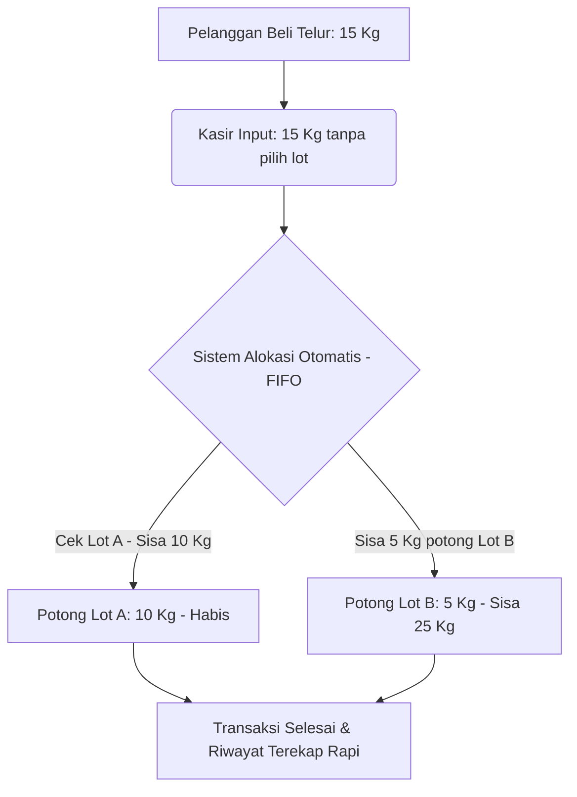

# Analisis Alur Penjualan & Rencana Pengembangan POS — RayFarm

Dokumen ini menganalisis efektivitas alur penjualan (POS) mockup saat ini (input batch manual, pilihan unit Butir vs Kg, dan pemotongan stok proporsional) dibandingkan dengan operasional nyata di peternakan ayam petelur (layer farm), serta merancang solusi pengembangan yang lebih praktis namun tetap akurat.

---

## 1. Analisis Alur POS Saat Ini (Mockup)

Dalam desain POS saat ini, alur penjualan berjalan sebagai berikut:
1. Kasir memilih komoditas (misal: Telur Grade A).
2. Kasir **wajib memilih Lot/Batch secara manual** dari dropdown.
3. Kasir memilih satuan transaksi: **Butir/Pcs** atau **Kilogram/Kg**.
4. Sistem melakukan **pemotongan stok ganda secara proporsional** berdasarkan rasio berat per butir lot terpilih.

### 🔴 Kendala Operasional di Lapangan (Friction Points)
Meskipun alur di atas secara matematis sangat akurat, di dunia nyata alur ini memiliki tingkat friksi yang tinggi untuk kasir:
* **Kecepatan Layanan Lambat:** Pada jam-jam sibuk, kasir tidak memiliki waktu untuk mencocokkan nomor lot fisik (yang tertempel di rak/peti) dengan pilihan lot di layar komputer untuk setiap pelanggan.
* **Resiko Selisih Data Tinggi:** Jika kasir salah memilih lot (misal telur fisik diambil dari lot panen pagi, namun di sistem diinput lot panen kemarin), data stok per lot akan langsung kacau/desinkronisasi meskipun total stok komoditas di sistem tetap sama.
* **Kebingungan Konversi Butir/Kg:** Pembeli jarang membeli telur kiloan dengan angka desimal acak yang dihasilkan dari konversi butir (misal membeli 10 butir telur lalu sistem mencatat beratnya 0,62 kg). Sebaliknya, pembeli grosir membeli per kilogram bulat (misal 10 kg, 15 kg), sementara pembeli eceran membeli per butir bulat.

---

## 2. Bagaimana Praktik Nyata Penjualan Telur di Peternakan?

Di peternakan komersial skala menengah hingga besar, telur tidak dijual butir-per-butir secara longgar kecuali untuk retail skala kecil di gerai farm. Penjualan telur didominasi oleh **grosir/tengkulak** dengan pola berikut:

| Satuan Riil | Estimasi Jumlah Butir | Rata-Rata Berat Netto | Media Kemasan | Penggunaan Umum |
| :--- | :--- | :--- | :--- | :--- |
| **Tray (Karton)** | 30 Butir | ± 1.8 s.d. 2.0 kg | Karton Tray Abu-Abu | Penjualan agen kecil, konsumsi toko ritel |
| **Ikat (Ikat Tray)** | 150 s.d. 180 Butir | ± 10 s.d. 12 kg | 5-6 Tray diikat tali rafia | Distribusi logistik standar pasar basah |
| **Peti (Kotak Kayu)** | ± 160 s.d. 170 Butir | **Pas (10 Kg atau 15 Kg)** | Kotak Kayu tradisional | Penjualan partai besar (grosir/tengkulak) |

### 💡 Fakta Kunci Lapangan:
1. **Transaksi Dominan Berbasis Timbangan:** Grosir telur selalu bertransaksi dengan menimbang total berat telur beserta peti/kemasannya, lalu dikurangi berat kosong wadah (**Tare/Timbangan Kosong**). Pembayaran dihitung per kilogram ($Rp/Kg$).
2. **Lot/Batch FIFO Mengalir Alami:** Peternakan selalu menerapkan FEFO/FIFO secara fisik di gudang. Telur yang dipanen terlebih dahulu akan diletakkan di area paling luar agar diangkut duluan oleh kuli muat. Kasir tidak perlu memilih lot secara manual karena alur fisik di gudang sudah pasti runtut.

---

## 3. Solusi Alternatif yang Lebih Praktis & Cepat

Berikut adalah rekomendasi penyederhanaan alur penjualan yang **lebih mudah bagi kasir** namun **tetap terekap secara detail** di database inventory/lot:

### Solusi A: Otomatisasi Batch dengan FIFO (Auto-Batch Allocation)
* **Konsep:** Kasir tidak perlu memilih lot di modal POS. Mereka cukup menginput nama produk dan jumlah yang dibeli.
* **Cara Kerja:** Sistem secara otomatis memotong stok dari batch/lot aktif yang paling lama (berdasarkan `receiveDate` atau `expiryDate` terdekat). Jika batch tertua habis, sisa potongan otomatis berlanjut ke batch berikutnya (*Split-batch allocation*).
* **Keunggulan:** Transaksi kasir menjadi sangat cepat (cukup 1-2 klik).

---

### Solusi B: Sistem Shortcut Satuan Kemasan Standardized (Tray / Ikat / Peti)
* **Konsep:** POS menyediakan tombol shortcut untuk kemasan standar.
* **Cara Kerja:** 
  - Saat kasir mengeklik "Telur Grade A", kasir bisa memilih shortcut: `[ +1 Tray ]`, `[ +1 Ikat ]`, atau `[ +1 Peti ]`.
  - Sistem menggunakan nilai estimasi konversi default untuk mempercepat input, namun kasir tetap bisa mengedit angka berat netto riil jika menimbang ulang (karena berat telur per tray fluktuatif).
* **Keunggulan:** Mengurangi kesalahan ketik manual dan mempercepat pencatatan penjualan grosir.

---

### Solusi C: Integrasi Kalkulator Timbangan (Gross & Tare Weight)
* **Konsep:** Menyederhanakan penulisan berat netto telur yang sering kali harus dikurangi berat peti kayu kosong.
* **Cara Kerja:** Pada form input berat Kg, sediakan helper input sederhana:
  $$\text{Berat Bersih (Netto)} = \text{Berat Timbangan (Gross)} - \text{Wadah (Tare)}$$
  *Contoh:* Kasir menimbang telur sekeranjang penuh = 11.8 kg. Kasir memilih wadah "Peti Kayu" (Tare: 1.8 kg). Sistem otomatis mencatat berat netto penjualan sebesar **10.0 kg**.

---

## 4. Rencana Roadmap Pengembangan POS RayFarm

Untuk mengimplementasikan perubahan di atas tanpa merusak struktur data mockup yang sudah ada, berikut tahapan pengembangan yang direkomendasikan:

### Tahap 1: Implementasi Auto-Selection (FIFO) dengan Opsi Override
* **Di Layar POS:** 
  - Biarkan dropdown lot pilihan tetap ada, namun ubah opsi pertamanya menjadi **"Otomatis (Rekomendasi FIFO)"** dan set sebagai nilai *default*.
  - Jika kasir membiarkan opsi ini, sistem akan membagi potongan stok secara otomatis ke lot tertua. 
  - Kasir hanya perlu mengubah lot secara manual jika ada pembeli khusus yang meminta panen hari tertentu (*custom request*).

### Tahap 2: Penambahan Shortcut Satuan Kemasan di Keranjang Belanja
* Tambahkan tombol increment di sebelah item keranjang untuk menambahkan kelipatan retail/grosir dengan cepat:
  - Button `+1 Tray` (otomatis menambah 30 Pcs / estimasi 1.9 Kg)
  - Button `+1 Peti` (otomatis menambah estimasi 165 Pcs / 10 Kg)

### Tahap 3: Pemisahan Jurnal Stok Riil vs Jurnal Keuangan
* Sistem POS hanya merekam total berat kilogram riil yang ditimbang untuk keperluan **penagihan keuangan** ($Rp \times Kg$), sedangkan penyusutan jumlah butir dihitung menggunakan rata-rata rasio lot harian guna menjaga keakuratan kartu stok digital tanpa membebani kasir.

> [!NOTE]
> Pendekatan gabungan antara **Otomatisasi FIFO** (Tahap 1) dan **Shortcut Kemasan** (Tahap 2) adalah opsi terbaik untuk memodernisasi POS RayFarm agar siap digunakan oleh operator kandang riil tanpa memperlambat alur kerja fisik di gudang telur.
